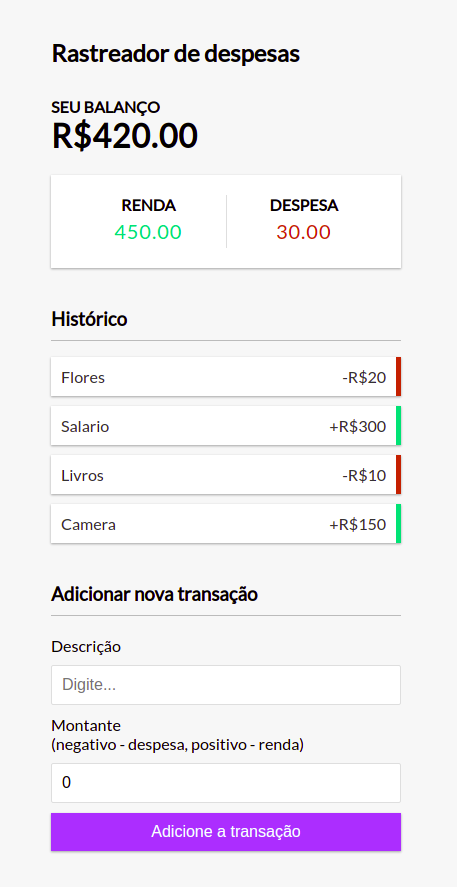

# Getting Started with Create React App

[expense-tracker-react](https://organizadorfinanceiro.netlify.app/)

### `Install dependencies`

Runs npm install to install dependencies

### `npm start`

Runs the app in the development mode.\
Open [http://localhost:3000](http://localhost:3000) to view it in the browser.

